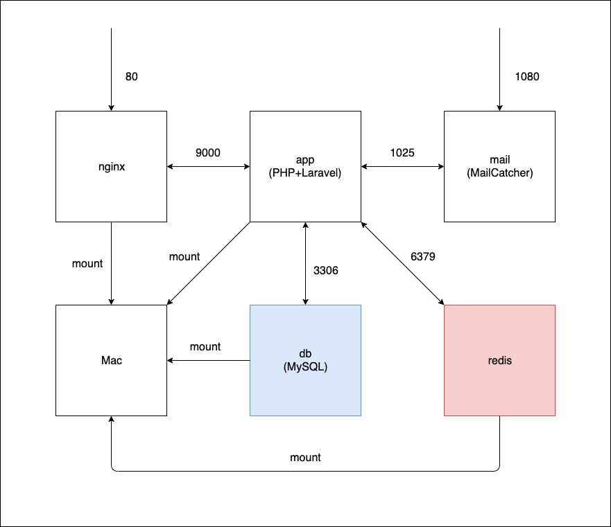

## 概要 
Laravel開発環境テンプレート
 
## ミドルウェアのバージョン
- PHP:7.4.x
- Laravel:6.x
- MySQL:5.7.x
- Redis:5.0.x
- Nginx:1.7.x
- MailCatcher

## 構成図


## 初期セットアップ
※ APP_KEYの値が変更されるので実行は初回だけにしてください
```
$ bash init-development.sh
```

## 通常開発時
```
$ docker-compose up
```

## サーバ設定変更時
```
$ docker-compose build
$ dokcer-compose up
```

## 開発時のSASS・JS監視
```
$ docker-compose exec app npm run watch
```
